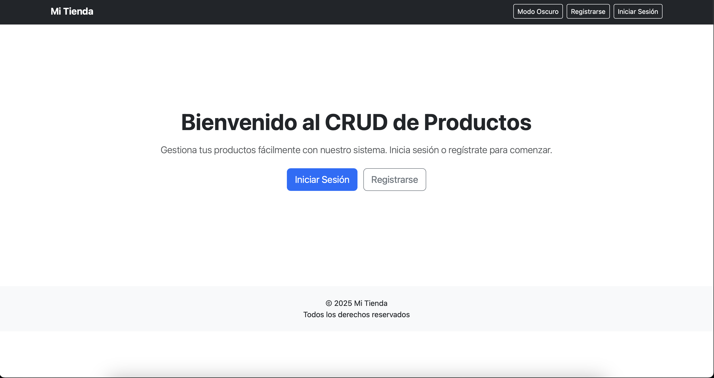
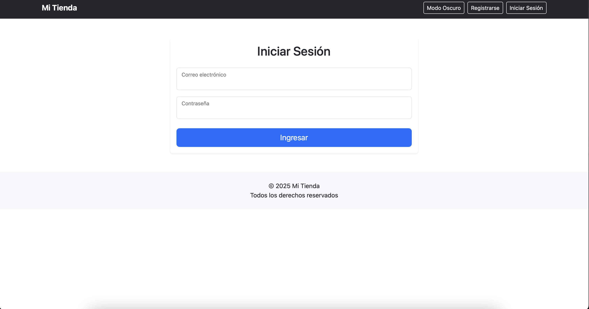
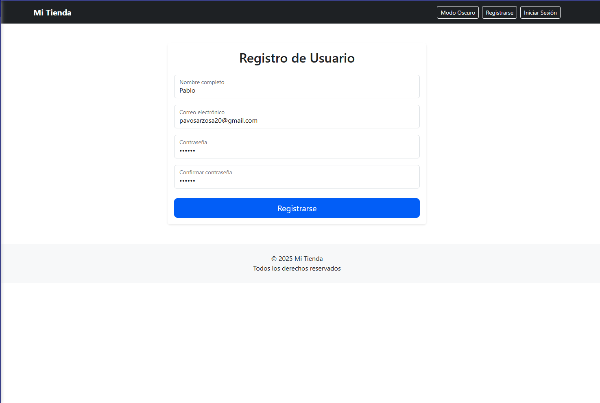
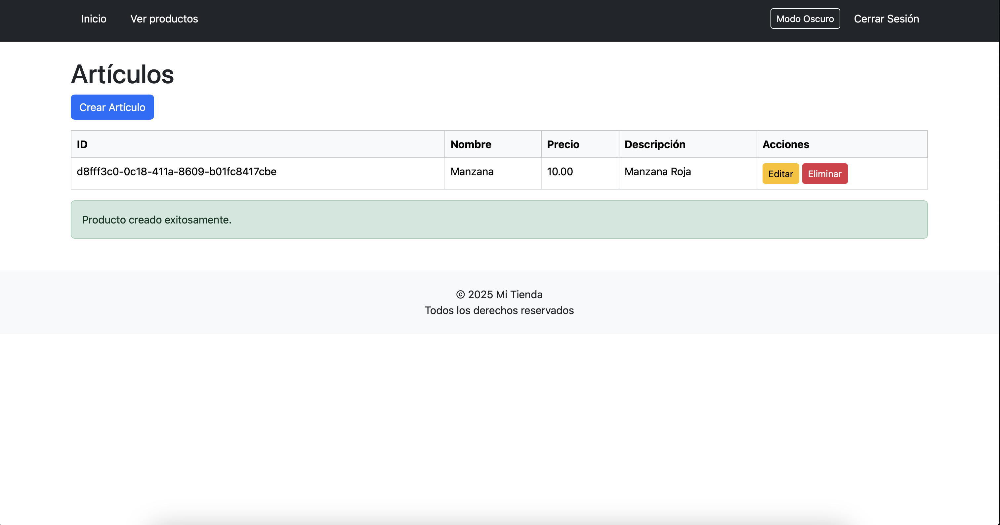
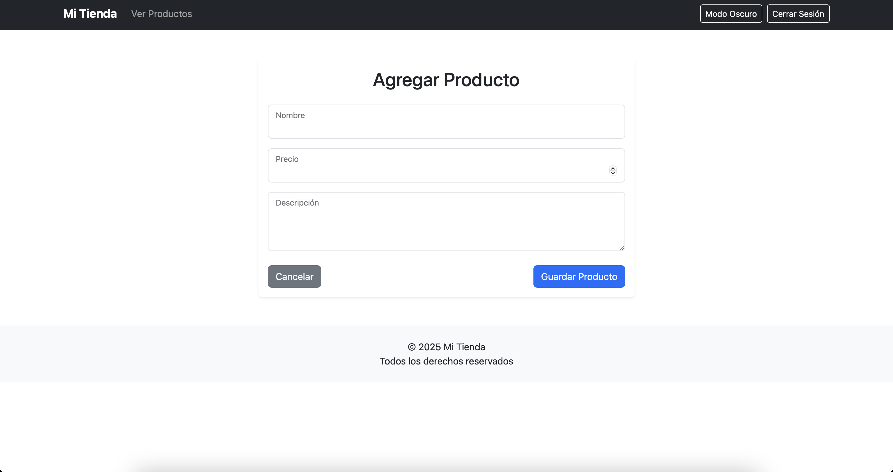
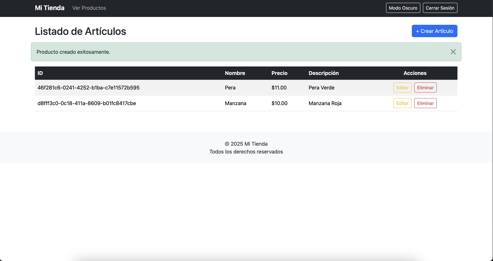
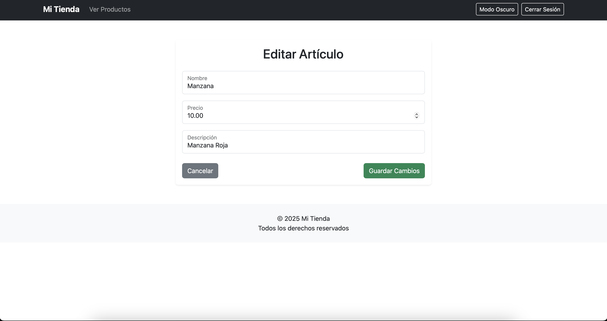
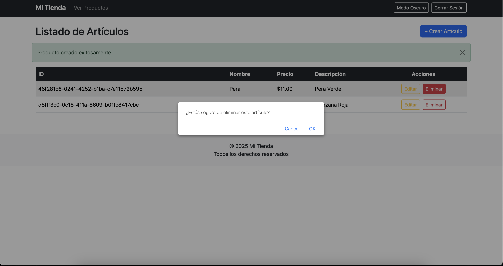

# Proyecto Laravel - CRUD de Productos

Este proyecto fue desarrollado como parte de una prueba técnica.  
Consiste en un sistema completo de autenticación de usuarios y gestión de productos.

---

## ☁️ Despliegue en AWS

La aplicación está actualmente desplegada en un entorno real utilizando:

- ✅ Amazon EC2 (servidor web con Laravel y PHP 8.2)
- ✅ Amazon RDS (MySQL como base de datos relacional)

🔗 Acceso al sistema (IP pública):

```
http://18.208.234.49
```

---

## 🛠 Tecnologías utilizadas

- Laravel 12+
- PHP 8.2 o superior
- MySQL / Amazon RDS
- Bootstrap 5

---

## 📦 Requisitos

- PHP 8.2 o superior
- Composer
- MySQL (puede ser local o en la nube como Amazon RDS)
- Navegador web moderno

---

## 🚀 Instrucciones de instalación

### 1. Clonar el repositorio

```bash
git clone https://github.com/PavoX20/SDM_2025.4.16.git
cd SDM_2025.4.16
```

### 2. Instalar dependencias

```bash
composer install
```

### 3. Copiar y configurar el archivo `.env`

```bash
cp .env.example .env
```

Edita las siguientes variables de conexión a base de datos con tus propios datos:

```env
DB_CONNECTION=mysql           # Tipo de base de datos (normalmente mysql)
DB_HOST=127.0.0.1             # Dirección del servidor de base de datos (puede ser localhost o el endpoint de RDS)
DB_PORT=3306                  # Puerto por defecto de MySQL
DB_DATABASE=nombre_base       # Nombre de la base de datos a usar
DB_USERNAME=usuario           # Usuario con permisos sobre esa base
DB_PASSWORD=contraseña        # Contraseña del usuario
```

> Ejemplo para Amazon RDS:
>
> DB_HOST=db-instance.abcdefgh1234.us-east-1.rds.amazonaws.com  
> DB_DATABASE=laravel_app  
> DB_USERNAME=admin  
> DB_PASSWORD=claveSegura123

### 4. Generar clave de aplicación

```bash
php artisan key:generate
```

### 5. Crear las tablas en la base de datos

> ⚠️ **Importante:** asegúrate de que la base de datos especificada en `.env` ya exista en tu servidor MySQL antes de ejecutar este paso.  
> Laravel **no crea automáticamente la base de datos**, solo las tablas. 

```bash
php artisan migrate
```

### 6. Levantar el servidor de desarrollo

```bash
php artisan serve
```

Luego accede desde tu navegador a `http://localhost:8000`  
O usa la IP pública si está desplegado en la nube.

---

## ✅ Funcionalidades

- Registro e inicio de sesión de usuarios
- CRUD completo de productos
- Middleware para protección de rutas
- Validaciones con mensajes personalizados
- Interfaz clara y moderna con Bootstrap 5
- Modo claro / oscuro con persistencia
- Responsive design
- Uso de UUID como clave primaria

---

## 📸 Capturas de pantalla

### Pantalla de bienvenida


### Login


### Registro de usuario


### Listado de productos


### Agregar producto


### Producto guardado exitosamente


### Editar producto


### Eliminar producto

